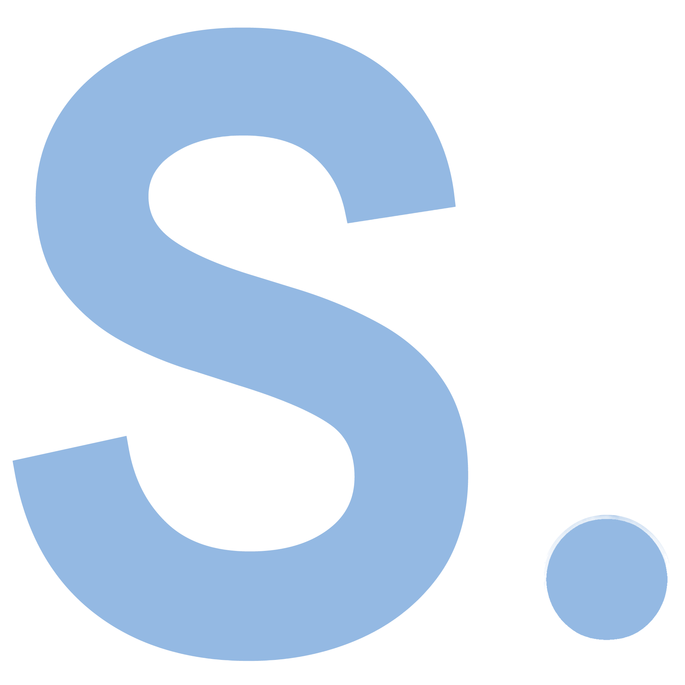

<!-- PROJECT LOGO -->
 

  

<h3 align="center">SimpleJS</h3>

  

    A simple JavaScript based machine learning library
     
    <a href="https://github.com/flug8/SimpleJS-lib/wiki"><strong>Explore the docs »</strong></a>
     
     
    <a href="https://simplejs.ai">Visit Website</a>
    ·
    <a href="https://github.com/flug8/SimpleJS-lib/issues">Report Bug</a>
    ·
    <a href="https://github.com/flug8/SimpleJS-lib/issues">Request Feature</a>
  

